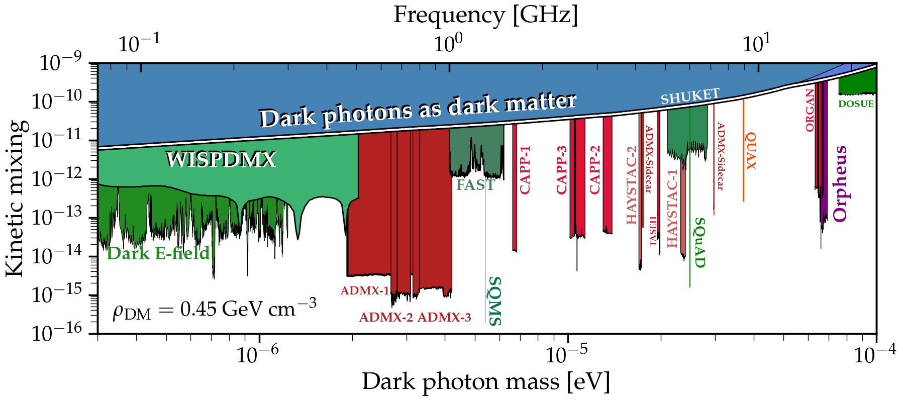
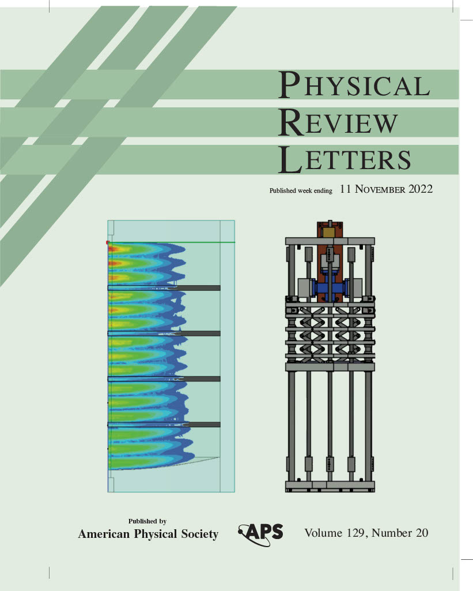

I am a physics postdoc at Fermilab in the Superconducting Quantum Materials and Systems Division (<a href="https://sqmscenter.fnal.gov/">SQMS</a>). My current focus is on using superconducting cavities and other Quantum Information Science (QIS) technologies to search for wavelike dark matter candidates such as axions and dark photons. I am also interested in using my expertise in RF electronics and microwave engineering to search for any interesting physics beyond the Standard Model. 

I have recently published a paper about achieving the best sensitivity to wavelike dark photon dark matter using an SRF cavity. The paper currently under review and can be found in the arxiv (<a href="https://arxiv.org/abs/2208.03183">arXiv:2208.03183</a>). The excluded parameter space is shown below and is an order of magnitude deeper than other microwave haloscope experiments. The figure is adapted from C. O'Hare 10.5281/zenodo.3932430.

I received my Ph.D. on November 2021 from the University of Washington where I focused on detecting axion dark matter with the ADMX collaboration. My thesis research was on developing ADMX-Orpheus: a dielectrically-loaded RF cavity to search for axions with masses higher than what is capable from current searches. This research was published in Physical Review Letters (<a href="https://journals.aps.org/prl/abstract/10.1103/PhysRevLett.129.201301">Phys. Rev. Lett. 129, 201301</a>) and Physical Review D (<a href="https://journals.aps.org/prd/abstract/10.1103/PhysRevD.106.102002">Phys. Rev. D 106, 102002</a>). Orpheus was chosen to be on the cover of PRL for the week of November 11, 2022.

I am also casual guitarist and a Brazilian Jiu-Jitsu white belt. I spend much of my night hours learning other skills like Spanish or yoga.
